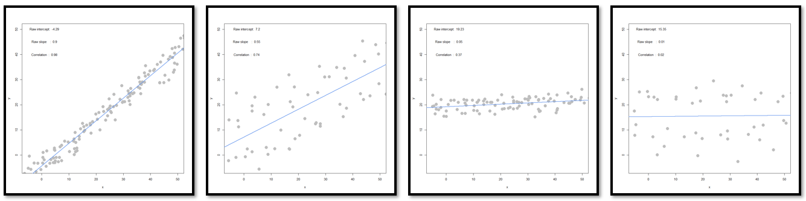

```{r, include=FALSE}
library(knitr)
library(GGally)
```

# Problem 1
**We will use the interactive_regression() function from CompStatsLib again – Windows users please make sure your desktop scaling is set to 100% and RStudio zoom is 100%;  alternatively, run R from the Windows Command Prompt.** 
```{r, out.width="95%", fig.align = "center", echo=FALSE}

```

**(a) Comparing scenarios 1 and 2, which do we expect to have a stronger R^2 ?** \
The R^2 is expected to be stronger for the scenario 1, because a strong R^2 is usually representated by a narrowly dispersed data. 

**(b) Comparing scenarios 3 and 4, which do we expect to have a stronger R^2 ?** \
For the same reasoning as (a), the R^2 is expected to be stronger for the scenario 3. 

**(c) Comparing scenarios 1 and 2, which do we expect has bigger/smaller SSE, SSR, and SST? (intuitively)** \
The SSE is expected to be smaller for the scenario 1, because there are less variability on the y axis. With small SSE, the greater the SSR and the smaller the SST. 

**(d) Comparing scenarios 3 and 4, which do we expect has bigger/smaller SSE, SSR, and SST? (intuitively)** \
For the same reasoning as (c), the SSE is expected to be smaller for the scenario 4. With small SSE, the greater the SSR and the smaller the SST. 

# Problem 2
**(a) Use the lm() function to estimate the regression model** \
```{r}
dataset <- read.csv(
    "G:/My Drive/111_2_BACS/HW10/programmer_salaries.txt", sep="\t")
salary_reg <- lm(dataset$Salary ~ dataset$Experience +
                          dataset$Score + dataset$Degree)
summary(salary_reg, data=dataset)
head(salary_reg$fitted.values, 5)
head(salary_reg$residuals, 5)
```
**(b) Use only linear algebra and the geometric view of regression to estimate the regression yourself:** \ 
**(i) Create an X matrix that has a first column of 1s followed by columns of the independent variables** \
```{r, results = FALSE}
X_mat <- cbind(1, dataset$Experience, dataset$Score, dataset$Degree)
```
**(ii) Create a y vector with the Salary values** \
```{r, results = FALSE}
y <- dataset$Salary
```

**(iii) Compute the beta_hat vector of estimated regression coefficients** \
```{r}
beta_hat <- solve(t(X_mat) %*% X_mat) %*% t(X_mat) %*% y
```

**(iv) Compute a y_hat vector of estimated y hat values, and a res vector of residuals** \
```{r}
y_hat <- X_mat %*% beta_hat 
res <- y - y_hat 
head(y_hat, 5)
head(res, 5)
```

**(v) Using only the results from (i) – (iv), compute SSR, SSE and SST** \
```{r}
SSR <- sum((y_hat-mean(y))^2)
SSE <- sum((y - y_hat)^2)
SST <- SSR + SSE
```
```{r, echo=FALSE}
print(paste("SSR: ", SSR))
print(paste("SSE: ", SSE))
print(paste("SST: ", SST))
```

**(c) Compute R^2 for in two ways, and confirm you get the same results** \ 
**(i) Use any combination of SSR, SSE, and SST** \
```{r}
r2_v1 <- SSR/SST
```
```{r, echo=FALSE}
print(paste("R-squared: ", r2_v1))
```
**(ii) Use the squared correlation of vectors y and y** \
```{r}
r2_v2 <- (cor(y, y_hat))^2
```
```{r, echo=FALSE}
print(paste("R-squared: ", r2_v2))
```

# Problem 3
**Take a look at the data set in file auto-data.txt. We are interested in explaining what kind of cars have higher fuel efficiency (mpg).** \
```{r}
auto <- read.table(
    "G:/My Drive/111_2_BACS/HW10/auto-data.txt",             
    header=FALSE, na.strings = "?")
names(auto) <- c("mpg", "cylinders", "displacement", 
                "horsepower","weight","acceleration", 
                "model_year", "origin", "car_name")
```

**(a) Let’s first try exploring this data and problem:** \
**(i) Visualize the data as you wish** \
```{r setup, out.width="110%", fig.align = "center", warning=FALSE}
opts_chunk$set()
ggpairs(auto, columns = 1:8)
```
**(ii) Report a correlation table of all variables, rounding to two decimal places** \
```{r}
round(cor(auto[1:8], use = "pairwise.complete.obs"), 2)
```

**(iii) From the visualizations and correlations, which variables appear to relate to mpg?** \
From the correlation table, we can observe that `mpg` and `weight` strongly correlated to each other. Not only that, `mpg` is highly correlated to `cylinders`, `displacement` and `horsepower`.

**(iv) Which relationships might not be linear?** \
`cylinders` vs. `origin` \ 
`model_year` vs. `weight` \
`mpg` vs. `origin` \
`model_year` vs. `acceleration` \

**(v) Are there any pairs of independent variables that are highly correlated (r > 0.7)** \
`cylinders` vs. `displacement` \
`cylinders` vs. `horsepower` \ 
`cylinders` vs. `weight` \
`displacement` vs. `horsepower` \
`displacement` vs. `weight` \
`horsepower` vs. `weight` \

**(b) Let’s create a linear regression model where mpg is dependent upon all other suitable variables** \
```{r}
auto_v1 <- lm(auto$mpg ~ 
    auto$cylinders + auto$displacement + 
    auto$horsepower + auto$weight +
    auto$acceleration + auto$model_year, 
    factor(auto$origin))
summary(auto_v1)
```
**(i) Which independent variables have a ‘significant’ relationship with mpg at 1% significance?** \
From the summary, `weight` and `model_year` have a significant relationship with `mpg` at 1% significance.

**(ii) Looking at the coefficients, is it possible to determine which independent variables are the most effective at increasing mpg? If so, which ones, and if not, why not?** \
In my opinion, by just looking at the variables name, we can determine which independent variable will be most effective at increasing `mpg`. Not only that, from the summary, we can also determine the strongest effect by observing the coefficients. 

**(c) Let’s try to resolve some of the issues with our regression model above.** \
**(i) Create fully standardized regression results: are these slopes easier to compare?** \
```{r}
auto_std <- data.frame(scale(auto[1:8]))
auto_std_v2 <- lm(auto_std$mpg ~ auto_std$cylinders + auto_std$displacement + 
    auto_std$horsepower + auto_std$weight + auto_std$acceleration + 
    auto_std$model_year + auto_std$origin)
summary(auto_std_v2)
```
Yes. After the standardization, it is easier to observe the slopes of all variables.

**(ii) Regress mpg over each nonsignificant independent variable, individually. Which ones become significant when we regress mpg over them individually?** \
```{r}
summary(lm(auto_std$mpg ~ auto_std$cylinders))
summary(lm(auto_std$mpg ~ auto_std$horsepower))
summary(lm(auto_std$mpg ~ auto_std$acceleration))
```
From the summaries showed above, we can see that all three variables are significant. 

**(iii) Plot the distribution of the residuals: are they normally distributed and centered around zero?** \
```{r, out.width="80%", fig.align = "center"}
plot(density(auto_v1$residuals), 
     main="Residuals of Regression",
     col="green", lwd=2)

plot(density(auto_std_v2$residuals), 
     main="Residuals of Standardized Regression",
     col="brown", lwd=2)
```
For both plots, it is normally distributed and centered around zero.